# SyncIt

## What is it for? 

SyncIt is a library to enable you to easily add synchronization to your (offline / phonegap or live) web Apps. This may be for allowing multiple users / devices to work offline or because the app has a live editing session with other users. 

## What does it do?

SyncIt is designed to do the following things:

 * Tracking versions of data.
 * Knowing which data is on the server.
 * Keeping a list of data which still needs to be sent to the server.
 * Supplying the App with all data required to handle version conflicts when they occur.

## What does it not do?

As important as what it does, is what it does not do. I have tried to make SyncIt as unintrusive as possible but still easy to use, so it does not:

 * Force you to use any specific server or server API.
 * Make you use jQuery, Dojo or anything else, it's pure portable JS.
 * SyncIt will not manage your connection to the server or tell you when you are connected.
 * Subordinate your code to SyncIt. You can put data into it and you can get data out of it, but it will happen when you want it to happen.

## What are the principes that SyncIt is built upon?

SyncIt takes it's main ideas from Version Control software, but specifically [Subversion](http://subversion.apache.org). I love distributed tools like [git](http://git-scm.com/) and [Mercurial](http://mercurial.selenic.com/) but when developing software I usually have a central server.

### Everything is versioned

Versioning in essential to synchronization, without a version number or hash it is impossible to check if anything has changed or detect conflicts.

### There is one central version of truth - The Server

A central server is required for synchronization to occur, it should hold all patches ever sent to the server

> Note: all documentation refers to a Server, because that is the normal use case, but it could be any central location.

### Clients must know what is on the server and be able to create local patches

Clients must be able to download information from the server. This server information can then have local patches applied to it.

### Local data not on server must be separated from data on the server

Local changes must be kept separate from data that is on the Server, this enables easy identification of what needs to be uploaded to the server and will allow rollback and merges of those local changes when errors occur.

### Local users must read the result of data which is on the Server and local changes to that data

Users will always have the expectation that their changes will be successfully applied to the server, so to the user their locally modified data is __the__ data. The API must support reading the result of taking the known-to-be-on-the-server data and applying local changes to it.

### Must be possible to get patches to send to the server

We must be able to get the local changes for the purpose of sending them to send to the server.

### Merges happen locally

If patches are rejected by the server, the client should be able to download the new patches from the server and merge them with the local patches, at which point it can then upload those merged patches to the server.

## How does it work?

Internally SyncIt stores data in a structure that I call Paths, though really it resembles something more like a multi rooted linked list. In graphical terms it looks something like the following:

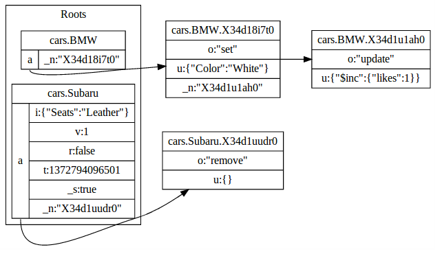

Data within SyncIt is organized around Datasets and Datakeys, thier SQL equivelants they would be tables and primary keys. In the example above the Dataset is Cars and there are BMW and Subaru Datakeys.

Next up is that everything that is not in the Root is a called a Pathitem and represents data which has yet to be sent to the server and is an update applied to the Root.

Roots themselves can have multiple Paths, in the example above both BMW and Subaru have just one Path which is shown on the left called "a". There will always be either one or two paths, the first is "a" which is used for normal storage, but there could potentially be a "c" path which is used during conflict resolution. Roots may also include data themselves. In the example above the Root for BMW is empty but Subaru includes data within it's "a" Path, this is called a Pathroot. When data is inside a Pathroot that is data which is known to be on the Server.

Another thing to note about this diagram is that the Pathitem store the modification time as part of the Key to the Pathitem, in the example above it is stored within "X34d1u1ah0", so there is no need to store that information within the Pathitem itself. If you want to access this functionality elsewhere where you are not using SyncIt look at `getTLIdEncoderDecoder.js`.

### The Process

#### Your App downloads updates from the Server

The App should download (or be pushed) an Array of Feeditem from the Server these may come from an AJAX request, from something like Socket.io or anything else.

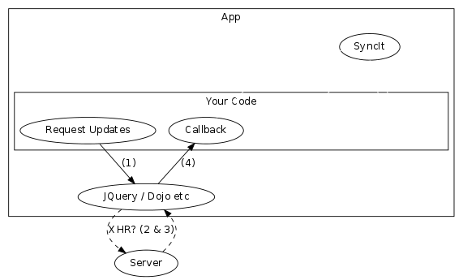

#### Your App should Feed them into SyncIt

Once your App has the Array of Feeditem from the Server it will need to Feed them into SyncIt. This is done with one API call:

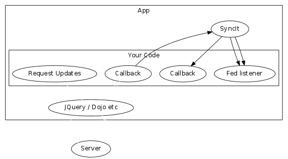

```javascript
syncIt.feed(
    [{Feeditem},{Feeditem},{Feeditem}], // The update from James
    function( ... ) { ... }, // Conflict Resolution - We'll get to this soon
    function(errorcode,unappliedFeeditem) { ... } // Callback when complete
);
```

This API call will eventually fire the final callback, when it does and the Errorcode is zero then the data has been imported into the SyncIt's PathStorage.

#### Your App can now work with the data locally

Now SyncIt knows the state of the data on the Server it can work with it locally, this might be reading:

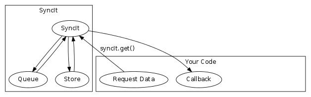

```javascript
syncIt.get(
    'cars',
    'Subaru',
    function(err,result) {
        if (err) {
            // Something went wront... throw?
        }
        alert(
            'The data stored in cars.subaru is: ' +
            JSON.stringify(result)
        );
    }
);
```

You may also choose to write data:

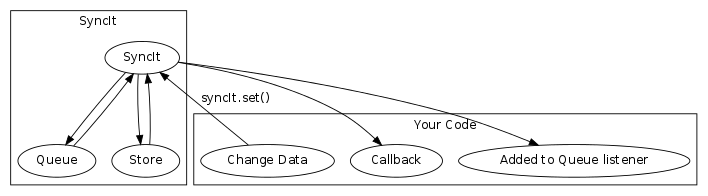

```javascript
syncIt.set(
    'cars',
    'Subaru',
	{ "Seats": "Leather" },
    function(err,result) {
        if (err) {
            // Something went wront... throw?
        }
        alert(
            'The data stored in cars.subaru is: ' +
            JSON.stringify(result)
        );
    }
);
```

#### Get (the first) data to upload to the server

Because SyncIt does not know anything about the implementation details of the server pushing changes it a two stage process. These are:

Your App should request the next Pathitem that needs uploading to the Server ( via `SyncIt.getFirst()` )from SyncIt then begin communicating that to the server.

##### Code to get the first Pathitem.

```javascript
syncIt.getFirst(function(err,pathitem) {
	if (err === SyncIt_Constant.Error.PATH_EMPTY) {
		// There is nothing left to upload
		return;
	}
    if (err !== SyncIt_Constant.Error.OK) {
        // Something went wront...
		// Perhaps another client/device has updated the same data
    }
	// You now have a Pathitem ready to upload
	xhr(...)
});
```

##### Diagram highlighting the retrieved item.

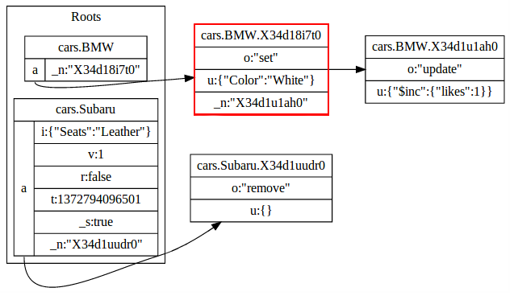

Note: This will not change the Paths in any way, the first Pathitem is highlighted in red, it is this one because the "X34d18i7to" includes the lowest timestamp as part of it's key.

#### Upload that first item onto the Server.

This is out-of-scope for SyncIt.

#### Advance that previously highlighted Pathitem into the Root

Assuming the Pathitem is accepted by the Server, the the SyncIt.advance() method should be used to apply that Pathitem to on top of the Root.

##### Code to advance the first Pathitem.

```javascript
syncIt.advance( function(err, appliedPathitem, storedrecord ) {
	if (err) {
        // Something went wront... throw?
	}
    alert(
		'Pathitem ' +
		JSON.stringify(appliedPathitem) + ' ' +
		'has been applied. The currently stored data is ' +
		JSON.stringify(storedrecord)
	);
});
```

##### Diagram after the SyncIt.advance() method is used.

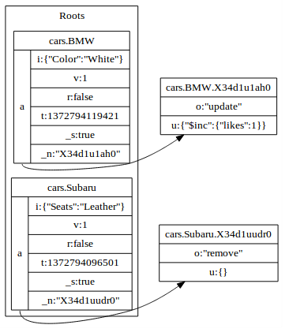

##### Full overall diagram of synchronization.


### What happens if the data is modified by two different users / devices?

At some point, you will find that data has been modified by two different users or devices. The first thing to note about this is that, just like Subversion, Git or Mercurial SyncIt does not dictate how conflicts should be resolved but instead fires a callback which exposes all required information for doing so. This is the middle parameter to the `SyncIt.feed()` function:

```javascript
syncIt.feed(
	[{Feeditem},{Feeditem}],
	function(dataset, datakey, storedrecord, localChanges, remoteChanges, resolved) {
		// The resolved function takes two parameter. The first is whether you have 
		// merged or not and the second are local changes to apply afterward the
		// remove changes.
		return resolved(true,[]);
	},
	function(err,remoteUpdatesNotFed) {
		// If you pass false into the resolved function, the Array removeUpdatesNotFed 
		// will have the remaining items in it and err will be NOT_RESOLVED.
	}
);
```

the overall process for your App will probably look something like the following:

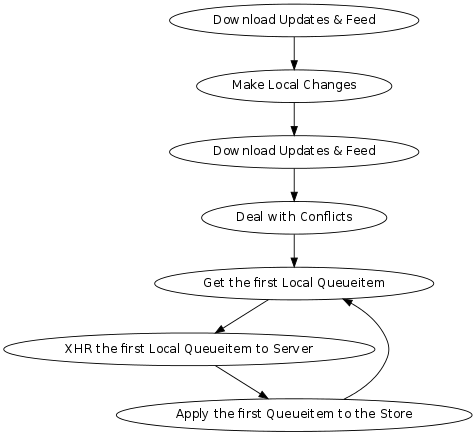

Should all uploads be successfully applied your App is then fully synchronized with the Server.

### Your App can register to recieve events for all the three types of operations:

```javascript
syncIt.listenForAddedToPath(
	function(dataset, datakey, pathitem) {
		// Redraw display for user
		// or something else?
	}
);
```

```javascript
syncIt.listenForFed(
	function(dataset, datakey, pathitem, resultingStorerecord) {
		// Redraw display for user
		// or something else?
	}
);
```

```javascript
syncIt.listenForAdvanced(
	function(dataset, datakey, pathitem, resultingStorerecord) {
		// Redraw display for user
		// or something else?
	}
);
```

## Is there a demo

There sure is. It's located [here](http://forbesmyester.github.io/SyncIt/demo/index.html).

## Have you got API Documentation?

There is a (reasonably) complete set of [API Docs](http://forbesmyester.github.io/SyncIt/docs/SyncIt.js.html).

## Special Thanks

I want to thank Vivek Manoharan for giving me help with this README and my wife Rei Owada for her support.

## Dictionary

Below you will find a dictionary for words used in SyncIt.

#### Pathstorage
The method used by SyncIt to store it's data, it is similar to a linked list in lots of ways, but the Roots can include many Paths.

#### Path
Pathstore can support any number of Path for a Dataset / Datakey so they could be used for different purposes. In practice SyncIt only uses an "a" path as it's main working area and occasionally may use a "c" path during conflict resolution.

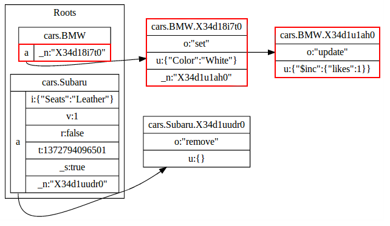

#### Pathitem
A Path is made up of multiple Pathitem. Each Pathitem represents one data change.


#### Root
The root can contain 0, 1 or more Pathroot. Each Root is tied to a Dataset and Datakey.

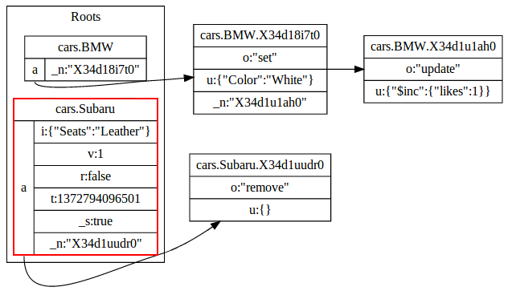

#### Pathroot
Pathroot is data stored within the root itself, these also may link to Pathitem.

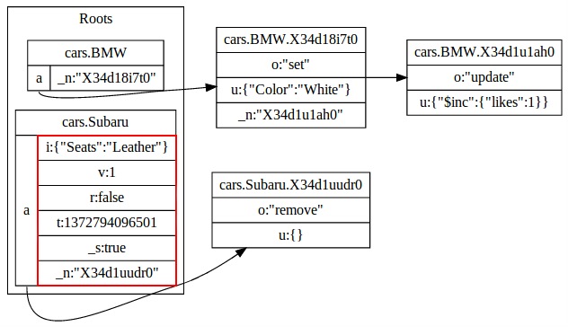

#### Server
The Server is not part of the SyncIt project, however the concept is that SyncIt will get Fed updates from the Server and will have it's Pathitem pushed into the Server by your app. Once a Pathitem is pushed to the Server it should be Advanced locally.

#### Dataset
The Dataset holds a collection of Datakey, which themselves hold Data.

#### Datakey
A Datakey is a single location where data is stored.

#### Reference
Within PathStorage, Pathitem are stored in the key [Dataset].[Datakey].[Reference] where the Reference is unique and convertable to a timestamp.

#### Feed
Feeding is the process of taking updates on the Server (called Feeditem) and attempting to merge them into the Pathroots. If there are Pathitem for any of the Dataset / Datakey which are being fed a Conflict will occur.

#### Conflict
Conflicts occur when Feeding data for which there is local Pathitem for the same Dataset / Datakey. This will fire the conflict resolution callback.

#### Advance
To update a Root once data has been uploaded to the server the SyncIt.advance() method is used. The method will remove the Pathitem and update the data in the Pathroot. Once this is done the Pathitem cannot be retrieved, except via the Server.

##### Operation
Pathitem perform an operation to modify data. Examples of Operations are "set", "update" and "remove".

##### Update
For "set" and "update" modifications, the Update is the data portion of a Pathitem / Operation.

##### Basedonversion
All Feeditem and Pathitem are based on a version and can only be used sequentially. For local Pathitem the Basedonversion can be deduced by reading the Path, but Feeditem which come from the server include a specific field ("b") to hold this information.

##### Modificationtime
The time at which the data was created. This is stored within "t" for Feeditem, for Pathitem is it encoded in the storage key itself.

##### Modifier
This uniquely identifies a client. If you are using this library from multiple devices the modifier should not be only tied to the User, but tied to the User and Device combination. This is not stored within Pathitem as it can be deduced, so it is only stored for Feeditem.

##### Version
The Pathroot will contain a version number in the "v" field.

##### Info
Data as apposed to metadata which is stored in a Pathroot. This is different from an Update in that it is the actual data itself as apposed to a patch to existing data.

#### Errorcode
When errors occur in SyncIt it will issue Errorcode back, it is usually the first parameter of callbacks.
