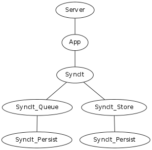
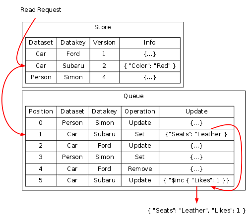
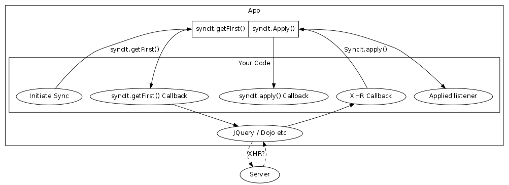
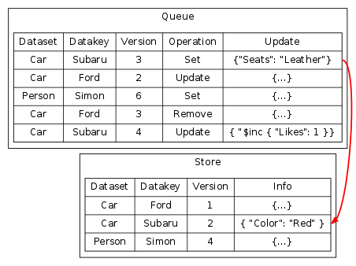
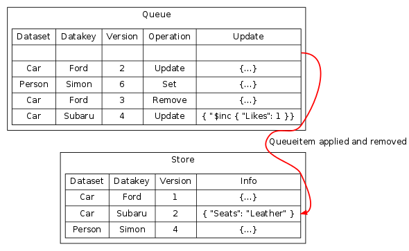

# SyncIt

## What is it for? 

SyncIt is a library to enable you to easily add synchronization to your (offline / phonegap or live) web Apps. This may be for allowing multiple users / devices to work offline or because the app has a live editing session with other users. 

## What does it do?

SyncIt is designed to do the following things:

 * Tracking versions of data.
 * Knowing which data is synchronized.
 * Keeping a list of data which still needs to be synchronized.
 * Supplying the App with all data required to handle version conflicts when they occur.

## What does it not do?

As important as what it does, is what it does not do. I have tried to make SyncIt as unintrusive as possible but still easy to use, so it does not:

 * Force you to use any specific server or server API though it does have it's own data format.
 * Make you use jQuery, Dojo or anything else, it's pure portable JS.
 * SyncIt will not manage your connection to the server or tell you when you are connected.
 * Subordinate your code to SyncIt. You can put data into it and you can get data out of it, but it will happen when you want it to happen.

## What are the principes that SyncIt is built upon?

SyncIt takes it's main ideas from Version Control software, but specifically [Subversion](http://subversion.apache.org). I love distributed tools like [git](http://git-scm.com/) and [Mercurial](http://mercurial.selenic.com/) but when developing software I usually have a central server.

### Everything is versioned

Versioning in essential to synchronization, without a version number or hash it is impossible to check if anything has changed or detect conflicts.

### There is one central version of truth - The Server

A central server is required for synchronization to occur, it should hold all patches ever sent to the server

> Note: all documentation refers to a Server, because that is the normal use case, but it could be any central location.

### Clients must know what is on the server and be able to create local patches

Clients must be able to download information from the server. This server information can then have local patches applied to it.

### Local data not on server must be separated from data on the server

Local changes must be kept separate from data that is on the Server, this enables easy identification of what needs to be uploaded to the server and will allow rollback and merges of those local changes when errors occur.

### Local users must read the result of the stored data and patches

Users will always have the expectation that their changes will be successfully applied to the server, so to the user their locally modified data is __the__ data. The API must support reading the result of taking the known-to-be-on-the-server data and applying local patches to it.

### Must be possible to get patches to send to the server

We must be able to get patches to send to the server, which will the either accepted or rejected, primarily based on version number.

### Merges happen locally

If patches are rejected by the server, the client should be able to download the new patches from the server and merge they with local patches, at which point it can then upload those merged patches to the server.

## How does it work?

SyncIt has two areas where it stores data, one is called the [Store](#store) and the other is called the [Queue](#queue).



### The Store

Data within the Store is organized into a Datasets and Datakeys. A Dataset is somewhat like a table in [MySql](http://www.mysql.com/) or a collection in [MongoDB](http://www.mongodb.org/) and the Datakey is like a primary key, so you could have a data structure like the folling:

<div class="container">
<table class="store-dataset">
	<caption><em>Dataset: Cars</em></caption>
	<tr><th>Datakey</th><th>Data</th><th>Version</th><th>Modifier</th></tr>
	<tr><td>Ford</td><td>{ "Color": "Red", "Owner": "Simon" }</td><td>1</td><td>Jack</td></tr>
	<tr><td>Subaru</td><td>{ "Color": "Blue", "Owner": "Alice" }</td><td>1</td><td>Jack</td></tr>
	<tr><td>Honda</td><td>{ "Color": "White", "Owner": "Alice" }</td><td>2</td><td>Jane</td></tr>
</table>

<table class="store-dataset">
	<caption><em>Dataset: People</em></caption>
	<tr><th>Datakey</th><th>Data</th><th>Version</th><th>Modifier</th></tr>
	<tr><td>Simon</td><td>{ "Role: "Programmer", "Age": 37 }</td><td>4</td><td>Jane</td></tr>
	<tr><td>Alice</td><td>{ "Role: "Lawyer", "Age": 32 }</td><td>2</td><td>Joe</td></tr>
</table>
</div>

SyncIt will also store the Version and Modifier of data in the Store. Data in the Store is what is already on the Server and is therefore guaranteed not to be rolled back. The records within the Store are called [Storerecord](#storerecord).

### The Queue

The Queue stores local modifications to the data within the Store. When data is being read from SyncIt it will first read the Storerecord from the Store and then read through every Queueitem for that same Dataset and Datakey to give you the result. The table below illustrates an example reading process for Car/Subaru.



### The Process

#### Your App downloads updates from the Server

The App should download (or be pushed) an Array of Queueitem from the Server these may come from an AJAX request or from something like Socket.io or anything else.


#### Your App should Feed them into SyncIt

Once your App has the Array of Queueitem from the Server it will need to Feed them into SyncIt. This is done with one API call:


```javascript
syncIt.feed(
    [{Queueitem},{Queueitem},{Queueitem}], // The update from James
    function( ... ) { ... }, // Conflict Resolution - We'll get to this soon
    function(errorcode) { ... } // Callback when complete
);
```

This API call will eventually fire the final callback, when it does and the Errorcode is zero then the data has been imported into the SyncIt's Store.

#### Your App can now work with the data locally

Now SyncIt knows the state of the data on the Server it can work with it locally, this might be reading:


```javascript
syncIt.get(
    'cars',
    'Subaru',
    function(err,result) {
        if (err) {
            // Something went wront... throw?
        }
        alert(
            'The data stored in cars.subaru is: ' +
            JSON.stringify(result)
        );
    }
);
```

You may also choose to write data:


```javascript
syncIt.set(
    'cars',
    'Subaru',
	{ "Optional Extras": ["Alloys"] },
    function(err,result) {
        if (err) {
            // Something went wront... throw?
        }
        alert(
            'The data stored in cars.subaru is: ' +
            JSON.stringify(result)
        );
    }
);
```

The set operation will add a Queueitem to the end of the Queue.

#### At some point you will want to put these local updates onto the server

Because SyncIt does not know anything about the implementation details of the server pushing changes it a two stage process. These are:

 1. Your App should request the next Queueitem that needs uploading to the Server from SyncIt then begin communicating that to the server ( SyncIt.getFirst() ).
 2. The server will either Accept or Reject your Queueitem, assuming it is accepted your App should notify SyncIt it has been uploaded ( SyncIt.apply() ).



```javascript
syncIt.getFirst(function(err,queueitem) {
	if (err === SyncIt_Constant.Error.QUEUE_EMPTY) {
		// There is nothing left to upload
		return;
	}
    if (err !== SyncIt_Constant.Error.OK) {
        // Something went wront...
		// Perhaps another client/device has updated the same data
    }
	// You now have a Queueitem ready to upload
	xhr(...)
});
```

Note: This will not change the Queue in any way.

Assuming the Queueitem is accepted by the Server, the first local Queueitem should then be applied to the local Store so that Dataset/Datakey matches the state on the Server in the Store and the Queueitem should then be removed.

```javascript
jamesSyncIt.apply( function(err, appliedQueueitem, storedrecord ) {
	if (err) {
        // Something went wront... throw?
	}
    alert(
		'Queueitem ' +
		JSON.stringify(appliedQueueitem) + ' ' +
		'has been applied. The currently stored data is ' +
		JSON.stringify(storedrecord)
	);
});
```

##### Diagram of the Applying process - Before:



##### Diagram of the Applying process - After:



### What happens if the data is modified by two different users / devices?

At some point, you will find that data has been modified by two different users or devices. The first thing to note about this is that, just like Subversion, Git or Mercurial SyncIt does not dictate how conflicts should be resolved but instead exposes a callback which exposes all required information for doing so. This is the middle parameter to the `SyncIt.feed()` function:

```javascript
syncIt.feed(
	[{Queueitem},{Queueitem}],
	function(dataset, datakey, storedrecord, localChanges, remoteChanges, resolved) {
		// The resolved function takes two parameter. The first is whether you have 
		// merged or not and the second are local changes to apply afterward the
		// remove changes.
		return resolved(true,[]);
	},
	function(err,remoteUpdatesNotFed) {
		// If you pass false into the resolved function, the Array removeUpdatesNotFed 
		// will have the remaining items in it and err will be NOT_RESOLVED.
	}
);
```

the overall process for your App will probably look something like the following:


Should all uploads be successfully applied your App is then fully synchronized with the Server.

### Your App can register to recieve events for all the three types of operations:

```javascript
syncIt.listenForAddedToQueue(
	function(dataset, datakey, queueitem) {
		// Redraw display for user
		// or something else?
	}
);
```

```javascript
syncIt.listenForFed(
	function(dataset, datakey, queueitem, resultingStorerecord) {
		// Redraw display for user
		// or something else?
	}
);
```

```javascript
syncIt.listenForApplied(
	function(dataset, datakey, queueitem, resultingStorerecord) {
		// Redraw display for user
		// or something else?
	}
);
```

## Is there a demo

There sure is. It's located [here](http://forbesmyester.github.io/SyncIt/demo/index.html).

## Have you got API Documentation?

There is a (reasonably) complete set of [API Docs](http://forbesmyester.github.io/SyncIt/docs/SyncIt.js.html).
## Lets take a closer look at an example how this may work in real life.

### James changes data while offline

User James is sat on the the underground using an application developed using SyncIt. He is trying to decide what car to buy and the App performs the following change while out of mobile coverage.

    jamesSyncIt.set(
        'cars',
        'Subaru',
        { color: 'blue' }
        function(err) { if (err === SyncIt_Constant.Error.OK) {  success(); } }
    );

User  | Dataset | Datakey | Store | Queueitem Update
------|---------|---------|-------|-----------------
James | Cars    | Subaru  |       | { color: 'blue' }

The data from this operation is now stored in a queue of pending changes to be sent to the server but can be read by the App in the normal way, by calling `jamesSyncIt.get('cars','Subaru',function(err,data) { ... })`.

James is happy because he is making progress on deciding on his next car.

### James reconnects to the Internet

Later, when James exits the underground the App detects that it can connect and makes the following API call:

    syncIt.getFirst(function(err,queueitem) {
        if (err !== SyncIt_Constant.Error.OK) {
            // throw?
        }
        xhr(
            'http://server/' + queueitem.s + '/' + queueitem.k,
            {
                method: 'PATCH',
                ...
            }
        ).then(
            function() {
                // data now stored on server
                jamesSyncIt.apply(function(err) {
                    ...
                });
            },
            function(err) {
                // something went wrong... throw err?
            }
        );
    });

User  | Dataset | Datakey | Store                                  | Queueitem
------|---------|---------|----------------------------------------|-----------
James | Cars    | Subaru  | { color: 'blue' } (v1)

At this point the data is now stored on the server and the App has recorded the fact by moving the data from the queue to the store.

The reason this is two steps as apposed to the one commit step for Subversion is that I viewed the communication with the server to be something that should be incredibly easy to change and tweak by the App developer.

### Emily receives the update and responds

His wife, Emily is using the same App and either through a push notification or polling gets James's update from the server which calls:

    emilySyncIt.feed(
        [Queueitem], // The update from James
        function( ... ) { ... }, // Conflict Resolution - We'll get to this soon
        function(err) { ... }
    );

User  | Dataset | Datakey | Store                                  | Queueitem
------|---------|---------|----------------------------------------|-----------
James | Cars    | Subaru  | { color: 'blue' } (v1)               |
Emily | Cars    | Subaru  | { color: 'blue' } (v1)               |

This will add the change to the local store, assuming that there are no local changes for the same data, which we will get to later.

Emily does not like the idea of thier car being a Subaru and makes the following changes:

    emilySyncIt.set(
        'cars',
        'Subaru',
        { color: 'blue', style: 'a bit too boy racer for Emily' }
    );

User  | Dataset | Datakey | Store                                  | Queueitem
------|---------|---------|----------------------------------------|-----------
James | Cars    | Subaru  | { color: 'blue' } (v1)                 |
Emily | Cars    | Subaru  | { color: 'blue', style: 'a bit too boy racer for Emily' } (v2)

Because she is still in the park and has good mobile coverage that change is uploaded to the server and then applied immediately using `emilySyncIt.getFirst()` and `emilySyncIt.apply()` seen earlier for James.

### Both users make edits and conflict resolution is used.

James is again out of mobile coverage and is completely unaware of Emily's change but has discovered that Subaru's are four wheel drive...

    jamesSyncIt.update(
        'cars',
        'Subaru',
        { $set: { pluspoints: ['has 4WD'] }, $inc { votes: 1 } },
        function(err) { if (err === SyncIt_Constant.Error.OK) {  success(); } }
    );

User  | Dataset | Datakey | Store                                  | Queueitem                                                     | Reads
------|---------|---------|----------------------------------------|---------------------------------------------------------------|------------
James | Cars    | Subaru  | { color: 'blue' } (v1)                 | { $set: { pluspoints: ['has 4WD'] }, $inc { votes: 1 } } (v2) | { color: 'blue', pluspoints: 'has 4WD', votes: 1 }
Emily | Cars    | Subaru  | { color: 'blue', style: 'a bit too boy racer for Emily' } (v2) | | { color: 'blue', style: 'a bit too boy racer for Emily' }

Now both users have made changes to the same data structure, but Emily's change has already been sent to the server.

James reconnects to the Internet and the changes are downloaded, at this point his client (and SyncIt) have enough information to detect a version conflict.

What is the correct course of action that James's App should take in this situation? First of all it has to detect that a conflict has actually occured but it must also be capable of resolving that conflict, probably automatically, but potentially with user intervention.

Internally SyncIt stores everything including a Modifier and a Version. The data structure looks something like the following:

    {
        s: "cars", // dataset
        k: "Subaru", // datakey
        b: 1, // what version this Queueitem is based on (so this is version 2)
        m: "james", // the user/device that made the change
        o: "update", // the operation that was performed
        t: 1369345483365, // timestamp when the operation was performed
        u: { // the data for the operation
            "$set": { "pluspoints": ["has 4WD"] },
            "$inc" { "votes": 1 }
        } 
    }

So conflicts are possible to detect by comparing versions.

The second part of the solution is that `SyncIt.feed()` includes a callback parameter for a conflict resolution function.

    SyncIt.feed(feedQueueItems,resolutionFunction,feedDone)

The reason for conflict resolution being a callback function I feel it would be impossible for SyncIt to dictate and could be part of your core application logic. So the code/data for feeding data into SyncIt could end up looking something like the following:

    SyncIt.feed(
        [{ 
            // The data which has been recieved from other parties via a server
            "s": "cars",
            "k": "Subaru",
            "u": { color:'blue', style:'a bit too boy racer for Emily' },
            "o": "set", "b": 1, "m": "emily", "t": 1369345483321
        }],
        function(dataset, datakey, stored, localChanges, remoteChanges, resolved) {
            
            // This is a super basic, perhaps too basic, example of a conflict
            // resolution function that will apply the local update on top of 
            // the remote update if it has a later timestamp
            
            if (
                localChanges[localChanges.length - 1].t >
                    remoteChanges[remoteChanges.length - 1].t
            ) {
                // James made the last change, so blindly take it!
                return resolved(
                    true,
                    [remoteChanges[remoteChanges.length - 1]]
                );
            }
            
            // Emily made the last change, so we will throw away our changes
            return resolved(true,[]);
        },
        function(err,remoteUpdatesNotFed) {
            if (err === SyncIt_Constant.Error.OK) {
                return success();
            }
            // err explains the reason for the error
            // remoteUpdatesNotFed includes the update that are on the server 
            // which we could not feed due to the error.
        }
    );

User  | Dataset | Datakey | Store                                  | Queueitem                                                     | Reads
------|---------|---------|----------------------------------------|---------------------------------------------------------------|------------
James | Cars    | Subaru  | { color: 'blue', style: 'a bit too boy racer for Emily' } (v2) | { $set: { pluspoints: ['has 4WD'] }, $inc { votes: 1 } } (v3) | { color: 'blue', style: 'a bit too boy racer for Emily', pluspoints: 'has 4WD', votes: 1 }
Emily | Cars    | Subaru  | { color: 'blue', style: 'a bit too boy racer for Emily' } (v2) | | { color: 'blue', style: 'a bit too boy racer for Emily' }

At this point Emily's change is stored in the Store with a locally Queueitem in the Queue for James adding the fact it is four wheel drive and with James's vote. If James still has mobile coverate after downloading the change that change can be immediately sent to the server and then applied locally.

## Todo

I need to do the following:

 * Public Facing
    * Add a license to all files (It'll be MIT/BSD)
    * Test demo (and everythign else!) in IE
 * Client SyncIt
    * localStorage for SyncIt (Store)
    * Add Async wrappers for Store & Persist
 * Server SyncIt
    * Create a real SyncItServer based on SyncItTestServer, it should be pretty easy, because SyncItTestServer is pretty abstracted.
    * I want to make ServerPersist for both MongoDB and DynamoDB.
 * Next Steps
    * Use this in a real project with a Browser and mobile (Phonegap based) clients.
    * Add SyncIt.purge() methods to free space from SyncIt.

## Dictionary

Below you will find a dictionary for words used in SyncIt.

#### Store
The Store will hold data that is on the Server. It cannot be modified directly, though Applying Queueitem will change it.

#### Queue
A series of Queueitem are held in the Queue.

#### Server
The Server is not part of the SyncIt project, which is a client to it, however the concept is that SyncIt will get Fed updates from the Server and will have it's Queueitem pushed into the Server. Once a Queueitem is pushed to the Server it should be Applied locally.

#### Dataset
The Dataset holds a collection of Datakey, which themselves hold Data.

#### Datakey
A Datakey is a single (well two if you consider the Queue and Store) location where data is stored.

#### Conflict
Conflicts occur when Feeding data for which there is local Queueitem for the same Dataset / Datakey. This will fire the conflict resolution callback.

#### Apply
To update a Storerecord stored at a Dataset / Datakey Queueitem are applied to it. The Application of Queueitem cannot be undone by SyncIt so should be done after the Queueitem has been successfully sent to the server.

#### Feed
Feeding is the process of taking Queueitem from the Server and attempting to Apply them to the local Store. If there are Queueitem for any of the Dataset / Datakey which are being fed, Feeding will stop and a Conflict will occur.

#### Queueitem
Queueitems are patches to Storerecord. Queueitem come from one of two places, from the Server or locally. If they come from the Server they are Fed, otherwise they are either Applied or removed during Conflict.

##### Operation
Queueitem perform an operation with an Update to modify a Storerecord. Examples of Operations are "set", "update" and "remove".

##### Update
For "set" and "update" modifications, the data take the update as to control how the data is modified.

##### Basedonversion
All Queueitem are based on a Storerecord version unless there is no Storerecord version in which case it is 0. If you have two Queueitem for the same Dataset / Datakey the second Queueitem will have a Basedonversion one higher than the first.

##### Modificationtime
The time at which the Queueitem was created.

##### Modifier
This uniquely identifies a client. If you are using this library from multiple device synchronization the modifier should not be only tied to the User, but tied to the User and Device combination.

#### Storerecord
A Storerecord is what data is called within the Store. Storerecord should be data which is confirmed to be on the Server. Storerecord can only be change by Feeding or Applying Queueitem. Storerecord hold most metadata which is part of Queueitem but have two specific pieces which do not directly belong to Queueitem.

##### Version
The first Version for a Dataset / Datakey is 1. Subsequent Apply or Feed will increment this version.

##### Info
Data which is stored in a Storerecord is called Info. This is the result of Queueitem Update. 

#### Errorcode
When errors occur in SyncIt they will issue Errorcode back, it is usually the first parameter of callbacks.
